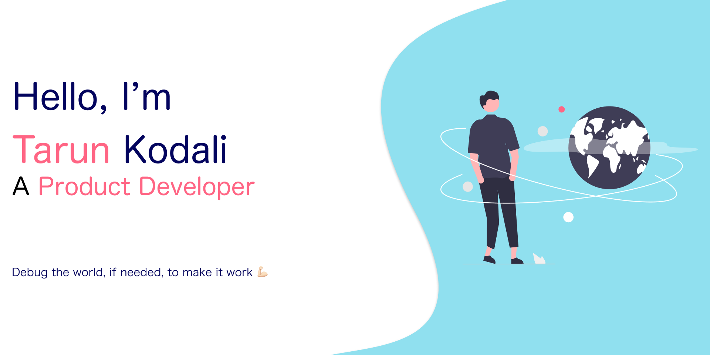

<div align="center">

### 👋 Full-Stack Product Developer | Mobile • Backend • AI

[](YOUR_PORTFOLIO_URL)
[](https://www.linkedin.com/in/tarun-naga-sai/)
[](mailto:tarunnagasai@icloud.com)
</div>

---

## 🚀 About Me

I build **production-ready mobile and backend applications** that scale. With 4 years of experience specializing in Flutter, AI integration, and full-stack solutions, I transform ideas into reality—handling everything from architecture to deployment.

- 🔭 Currently working on AI-powered mobile applications
- 💼 Available for freelance projects
- 🎯 Specialized in cross-platform mobile development with Flutter
- 🤖 Exploring AI/ML integration with LLMs and RAG architecture
- 💡 Passionate about creating seamless user experiences
- 📫 Reach me at: **tarunnagasai@icloud.com**

---

## 🛠️ Tech Stack

### Mobile Development


### Backend Development


### Databases


### AI/ML & Tools


---

## 💼 Featured Projects

### 🤖 [AI-Powered Projects](YOUR_AI_PROJECTS_LINK)
> Personal projects showcasing AI/ML capabilities

- 🎮 **Pokemon AI**: RAG architecture with vector embeddings and LLM integration
- 💰 **Crypto AI**: Real-time market analysis with intelligent prompting
- 🃏 **Flutter GenUI Templates**: GenUI implementation, A2UI interactions and GenUI with own selected.  
- 🧠 Demonstrates advanced AI integration capabilities for client projects

**Tech:** Python, Flutter (Riverpod), ChromaDB, LangChain, LLM APIs

---

### 📱 [HealthPass](YOUR_HEALTHPASS_LINK)
> Enterprise health & wellness mobile application

- 🏥 Integrated Apple Health & Google Fit for seamless health data sync
- 💬 Real-time video consultations with healthcare providers
- 🔄 Complete migration from native codebase to Flutter
- 📊 Advanced health metrics visualization and tracking

**Tech:** Flutter (GetX), Apple Health, Google Fit, Firebase, GCP

---

### 🌍 [Bumpedin](YOUR_BUMPEDIN_LINK)
> Location-based social discovery platform

- 📍 Real-time location tracking with 40% battery optimization
- 🔐 E2E encrypted chat supporting 500+ concurrent users
- 🎯 Built custom UI achieving 60fps performance
- 📈 Successfully deployed to 10K+ users with 99.9% crash-free rate

**Tech:** Flutter (Bloc), NestJS, PostgreSQL, Firebase Realtime DB

---

<!-- ---

## 📊 GitHub Stats

<div align="center">
  


</div>

--- -->

## 🎯 What I Offer

```dart
class ProductDeveloper {
  final skills = [
    '📱 Cross-Platform Mobile Apps (Flutter)',
    '⚙️ Scalable Backend Systems (Node.js, FastAPI)',
    '🤖 AI/ML Integration (LLMs, RAG)',
    '🏗️ Full-Stack Solutions',
    '🚀 CI/CD & Deployment',
  ];
  
  final achievements = {
    'users_served': '10K+',
    'uptime': '99.9%',
    'experience': '4+ years',
    'crash_free_rate': '99.9%',
  };
  
  void buildYourIdea() {
    print('Let\'s turn your vision into reality! 🚀');
  }
}
```

---

## 📫 Let's Connect

I'm always open to discussing new projects, creative ideas, or opportunities to be part of your vision.

<div align="center">

[](YOUR_PORTFOLIO_URL)
[](https://www.linkedin.com/in/tarun-naga-sai/)
[](mailto:tarunnagasai@icloud.com)
</div>

---

<div align="center">

### 💡 *"Debug the world, if needed, to make it work"* 💪

</div>